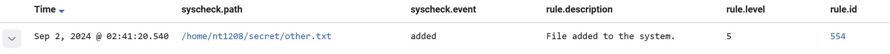

# SOC Automation Project
***
This is my personal project in Security Operation Center (SOC) field providing a solution to support SOC analyst get alerts about the anomaly activities happening in their agents automatically.

### Components
- **Wazuh (Server, Indexer, Dashboard**): 35.187.244.131
- **Windows Agent**: 20.189.116.194
- **Ubuntu Agent**: 34.87.141.84
- **Shuffle**: A SOAR platform that allow me create playbook for incident response.
- **Virustotal**: Enriches threat intelligence by providing detailed threat information from various sources, helping organizations and individuals assess and respond to potential threats.

The flowchart below illustrates how these components can work with each other.


### Configuration
**Wazuh (Server, Indexer, Dashboard):**
+ Ubuntu 22.04.01
+ Internal IP: 10.148.0.3
+ External IP: 35.187.244.131

**Windows Agent**
+ Windows 10 Pro
+ Internal IP: 10.0.0.4
+ External IP: 20.189.116.194

**Ubuntu Agent**
+ Ubuntu 22.04.01
+ Internal IP: 10.148.0.4
+ External IP: 34.87.141.84

In wazuh manager, edit `config.yml` file with this following information. Consequently, both 3 components have same IP address.


After installing wazuh manager, we have some credentials containing in `wazuh-passwords.txt` file which can use to log in wazuh dashboard.

Then, we need to add agents (Windows and Ubuntu) which can be tracked by server. Going to wazuh dashboard and `Endpoints` sections then, select `Deploy new agents` and follow the instructions in this page. The picture below is the configuration for Ubuntu Agent, similar steps apply to the Windows Agent as well.


If we add our agents successfully, we can view it in `Endpoints` section.


Note that we need to edit server address value to our server in Windows Agent.


#### Windows Agent
In Windows Agent, we need to install **Sysmon**, which can monitor and log events to `Windows Event Log`. We can install it through this <a href="https://learn.microsoft.com/en-us/sysinternals/downloads/sysmon">Link</a>.

After that, we need to add some information in `ossec.conf` to take `Sysmon` work with wazuh agent. 


The `location` value is a path which we can find it in `Windows Event Log`.


Because I want to test the status of wazuh agent wheather it work perfectly, i try to build some scenarios which mentioned later, therefore, I will install **Mimikatz** and **Apache2** for this purpose. We can install **Mimikatz** from <a href="https://github.com/gentilkiwi/mimikatz/releases">Github</a> and **Apache2** with this <a href="https://documentation.wazuh.com/current/proof-of-concept-guide/block-malicious-actor-ip-reputation.html">instruction</a>.


Add the following to C:\Program Files (x86)\ossec-agent\ossec.conf to configure the Wazuh agent and monitor the Apache access logs:


#### Ubuntu Agent
We also need to install Apache2 on Ubuntu Agent. Use `sudo apt install apache2` and `systemctl start apache2` to install and run Apache service.


#### Shuffle
I created a workflow that can process the incident respond. My topology as you can see in the picture below.


- **Webhook**: This node will receive alerts from Wazuh manager. To integrate it with Wazuh, i need to add these following configurations  to `/var/ossec/etc/ossec.conf`.  

The `hook_url` value can be found in webhook properties and the `rule_id` value is the rule ID of alert which I want Shuffle to receive detailed information.
- **HTTP-GET**: I use `curl` method to get `JWT` for authenticating with Wazuh manager. The purpose of this action is I can request Wazuh manager to block malicious IP address. I use this command to get the `JWT`:
```
curl -u <username>:<password> -k -X GET "https://35.187.244.131:55000/security/user/authenticate?raw=true"
```
`username` and `password` can be found  in `wazuh-passwords.txt` file
- **Virustotal**: I can integrate Wazuh and Virustotal just by this node. We solely need Virustotal API key and some configuration below to work with this strongly component.


- **User input**: This node require the user for the decision wheather they want to block the source IP address which is alerted to them. This requirement can be sent via email.
- **Wazuh**: This is the node to perform the decision of the user. If user want to block the source IP address, Wazuh will perform the active response which is configured by administrator. I configure `ossec.conf` with the command below.

This configuration mean every alert which has the level equal to 5 or above, `firewall-drop` command will execute to block the source IP address (srcip).
We can check if the active reponse exactly work by using `/var/ossec/bin/agent_control` script.

We can try the active response which a random IP addressby using this following command
```
./agent_control -b 1.1.1.1 -f firewall-drop0 -u 003
```
In Shuffle, I configure the data sending to Wazuh like this:


- **Conditions**
There are 2 conditions in the branches that I created in this workflow. One is from **HTTP-GET** to **VirusTotal** and the other is from **HTTP-GET** to **Email**. The purpose of the first condition is trigger Wazuh perform active response to block IP address, and the second condition is for alerting to user about file integrity issue.
*First condition*

*Second condition*


### Scenarios
I have built 5 scenarios for Ubuntu Agent and 3 for Windows agent:
**For Ubuntu Agent:**
+ SQL injection
+ File integrity
+ Brute-force attack
+ Shellshock atack
+ Block malicious actors

**For Windows Agent:**
+ SQL injection
+ File Integrity
+ Block malicious actors

For each scenario, I need to configure a little bit.

- **SQL injection**: This scenario is built for both Ubuntu and Windows agents. All of these need to run **Apache2** on their own machine and some configuration with `ossec.conf` file.

*On Ubuntu machine*
``` 
<!-- SQL Injection Detection -->
<ossec_config>
  <localfile>
    <log_format>apache</log_format>
    <location>/var/log/apache2/access.log</location>
  </localfile>
</ossec_config>
``` 
*On Windows machine*
```
<!-- SQL Injection Detection -->
<localfile>
  <log_format>syslog</log_format>
  <location>C:\Apache24\logs\access.log</location>
</localfile>
```
*On attacker machine*
```
curl -XGET "http://<IP_ADDRESS>/users/?id=SELECT+*+FROM+users";
```
Replace the `<IP_ADDRESS>` value to corresponding values.
As we can see on Wazuh alert, the rule ID for SQL injection is `31103`. 


- **File integrity**: This scenario is also built for Ubuntu and Windows agents. Let's configure `ossec.conf` file.
*On Ubuntu machine*
Adding the following command to `<syscheck>` block. `/home/nt1208/secret` is the directory we want to check file integrity.
```
<directories check_all="yes" report_changes="yes" realtime="yes">/home/nt1208/secret</directories>
```
*On Windows machine*
```
<directories check_all="yes" report_changes="yes" realtime="yes">C:\Secret</directories>
```
I create `secret.txt` file in `/home/nt1208/secret`. I will track the status of this file.


Let's modify this file by adding something.


Check alert on Wazuh manager. The rule ID is `550` for `modified` status.


Delete secret.txt with `rm secret.txt` and observe the alert on Wazuh. The rule ID for `deleted` status is `553`


Try to add `other.txt` file in `/home/nt1208/secret` directory and check the Wazuh alert. The rule ID for `added` status is `554`.



The familiar steps for Windows agent.

- **Brute-force attack**: I built this scenario for both Ubuntu and Windows agents, but there are some troubles with Windows agent and I'm trying to troubleshoot them.

*On Ubuntu machine*
Start **Apache** service with `systemctl start apache`

*On attacker machine*
Use this command to  emulate brute-force attack:
```
hydra -l badguy -P /usr/share/wordlists/rockyou.txt 34.87.141.84 ssh
```
Check the Wazuh alert and we can see that `5710` is for this attack.

 

 - **Shellshock attack**: This scenario also need **Apache** 

 *On Ubuntu machine*
 Add this configuration the `ossec.conf` file
 ```
 <localfile>
    <log_format>syslog</log_format>
    <location>/var/log/apache2/access.log</location>
</localfile>
``` 
*On attacker machine*
Use this command to perform Shellshock attack
```
sudo curl -H "User-Agent: () { :; }; /bin/cat /etc/passwd" 34.87.141.84
```
Let's check Wazuh alert and we see that Shellshock attack detection rule ID is `31168`

 

 - **Block malicious actors**: This scenario is built for both Ubuntu and Windows agents. Wazuh server use **Alienvault IP reputation database** to determine threat actor base on IP address.
 
 *On Ubuntu machine*
 Start **Apache** service and add the following configuration to `ossec.conf` file
 ```
 <localfile>
  <log_format>syslog</log_format>
  <location>/var/log/apache2/access.log</location>
</localfile>
```
*On Windows machine*
Start Apache service and add the following configuration to `ossec.conf` file
```
<localfile>
  <log_format>syslog</log_format>
  <location>C:\Apache24\logs\access.log</location>
</localfile>
```
*On Wazuh server*
1. Download the Alienvault IP reputation database:
```
sudo wget https://raw.githubusercontent.com/firehol/blocklist-ipsets/master/alienvault_reputation.ipset -O /var/ossec/etc/lists/alienvault_reputation.ipset
```
2. Append the IP address of the attacker endpoint to the IP reputation database. Replace <ATTACKER_IP> with the RHEL IP address in the command below. In my case that is **58.187.190.209**:
```
sudo echo "58.187.190.209" >> /var/ossec/etc/lists/alienvault_reputation.ipset.
``` 
3.  Download a script to convert from the .ipset format to the .cdb list format:
```
sudo wget https://wazuh.com/resources/iplist-to-cdblist.py -O /tmp/iplist-to-cdblist.py
```
4. Convert the alienvault_reputation.ipset file to a .cdb format using the previously downloaded script:
```
sudo /var/ossec/framework//bin/3 /tmp/iplist-to-cdblist.py /var/ossec/etc/lists/alienvault_reputation.ipset /var/ossec/etc/lists/blacklist-alienvault
```
5. Assign the right permissions and ownership to the generated file:
```
sudo chown wazuh:wazuh /var/ossec/etc/lists/blacklist-alienvault
```
6. Add a custom rule to trigger a Wazuh active response script. Do this in the Wazuh server `/var/ossec/etc/rules/local_rules.xml` custom ruleset file:
```
<group name="attack,">
  <rule id="100100" level="10">
    <if_group>web|attack|attacks</if_group>
    <list field="srcip" lookup="address_match_key">etc/lists/blacklist-alienvault</list>
    <description>IP address found in AlienVault reputation database.</description>
  </rule>
</group>
```
7. Add the following command to `ossec.conf` in `<ruleset>` block.
```
<list>etc/lists/blacklist-alienvault</list>
```
8. Note that our active response will block the alert had level 5 and above, therefore, active response will block IP Address from Alienvault ipset.
```
  <active-response>
    <disabled>no</disabled>
    <command>firewall-drop</command>
    <location>local</location>
    <level>5</level>
    <timeout>no</timeout>
  </active-response>
  ```
*On attacker machine*
Use the following commnad to perform attack:
```
curl http://34.87.141.84
```
Observe Wazuh alert, we can see that rule ID is `100100` and IP address is blocked by active response.

 

 In conclusion, the rule ID that I need to alert to **Shuffle** is `5710`, `31103`, `31168`, `100100`, `550`, `553`, `554`. Let's configure `ossec.conf` file in Wazuh server.
 ```
   <integration>
    <name>shuffle</name>
    <hook_url>https://shuffler.io/api/v1/hooks/webhook_1bc2a471-6426-4f7c-bcf6-f27ca166d277 </hook_url>
    <rule_id>5710,31103,31168,100100,550,553,554</rule_id>
    <alert_format>json</alert_format>
  </integration>
  ```
  Restart Wazuh manager service and it work perfectly.

  

  